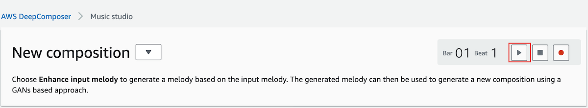
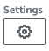
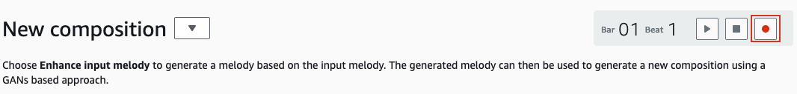

# Using the AWS DeepComposer Music studio to create tracks 

The AWS DeepComposer music studio allows you to create music using trained models. To create your next masterpiece 
you can record a custom input track, use a sample input track, or import a .midi track. 

After choosing the **Source of input melody** you can start generating compositions. 

## Getting started 
Browser support for the AWS DeepComposer console varies. We *recommend* using Chrome for this lab. If you want to know
more about which features are supported by different browsers check out the [Browser support documenation](https://docs.aws.amazon.com/deepcomposer/latest/devguide/browser-support.html). 

>**Note** The exercises in this lab assume you've signed in to the AWS DeepComposer console. To use the AWS DeepComposer
>console and other AWS services, you need an AWS account. If you don't have an account, see [aws.amazon.com](https://aws.amazon.com/)
>and choose **Create and AWS account**. For detailed instructions, see [Create and Activate an AWS Account](https://aws.amazon.com/premiumsupport/knowledge-center/create-and-activate-aws-account/)  

### Exploring the AWS DeepComposer music studio, make your first composition  

1. Open the [AWS DeepComposer console](https://console.aws.amazon.com/deepcomposer)

2. Open the navigation pane (&#9776;), choose **Music studio**

3. Choose &#9658; to play the default melody.

4. Choose **Generative Adversarial Network** from the **Model Parameters** card under **Generative AI technique**

5. Choose **Generate composition** to create a new composition

6. Choose &#9658; to listen to your new AI generative musical composition

### Changing the source of your input melody
The AWS DeepComposer supports uploading custom input melodies and recording custom melodies.

#### Recording a custom input melody 
Before recording a custom melody you can enable several settings to help make recording easier. 
To change your settings, choose the settings icon (&#x2699;)
    - **Metronome** will enable/disable a metronome being played while you are recording your melody. One the slider is enabled, you can adjust the metronome on the Music studio console.  
    - **Hot Keys** will allow you to use your computers keyboard when you are recording your melody 
    - **Countdown** enables a 5 second countdown before recording your melody 

1. Choose &#x25cf; to start recording a *custom melody*

2. When finished, choose &#9632;

3. To trim an unwanted section of the input melody, choose one of the handles on the sides of the track, and drag it to remove the unwanted section.

4. Choose **Generative Adversarial Network** from the **Model Parameters** card under **Generative AI technique**
>**NOTE

5. Choose &#9658; to listen to your new AI generative musical composition
    
    
    
  
    
    
    
    
    
    
    
    
    
    
    

## Input melody:

Click *record* to start recording

Play the notes on the physical keyboard provided

Stop recording by clicking the *record* button again

Play the recorded music to verify the input. In case you don’t like recorded music, you may start recording again by clicking *record*

Select **Jazz** model from *Model*

Click **Generate Composition** to generate a composition based on the input melody you provided. *Note: This step will take few minutes to generate a composition inspired by the chosen genre*

Click *play* to play the composition and enjoy the AI generated music

Try experimenting with different genres or sample input melody

**Congratulations! You have learnt how to use pre-trained models to generate new music**
