# Training a custom Generative adversarial network (GAN) model

In this directory you will find the files required to train a custom GAN model using a jupyter notebook. You can run this
project. 

**Note** 
> To use the AWS DeepComposer console and other AWS services, you need an AWS account. If you don't have an account, 
go to aws.amazon.com and choose **Create an AWS Account**. For detailed instructions, see [Create and Activate an AWS Account](https://aws.amazon.com/premiumsupport/knowledge-center/create-and-activate-aws-account/).

>As a best practice, you should also create an AWS Identity and Access Management (AWS IAM) user with administrator
permissions and use that user for all work that doesn’t require root credentials. 

## Goal

As part of this lab, you will learn to build a custom GAN architecture and train the model using Amazon SageMaker.

## Prerequisites

* Access to Amazon SageMaker

## Cost

Using a ml.c5.4xlarge, the entire exercise take 3-4 hrs to run. Please see the [Amazon SageMaker pricing](https://aws.amazon.com/sagemaker/pricing/) for details. 

## Setup

1. Launch SageMaker console 
2. Choose Notebook instance
3. choose create notebook instance 
4. Name
5. Notebook instance type `ml.c5.4xlarge`
6. IAM use or create a new role. (what add'l information would be good here)
7. 

First we create the Amazon SageMaker notebook instance.

Navigate to Amazon SageMaker using the link: https://console.aws.amazon.com/sagemaker/home?region=us-east-1#/dashboard

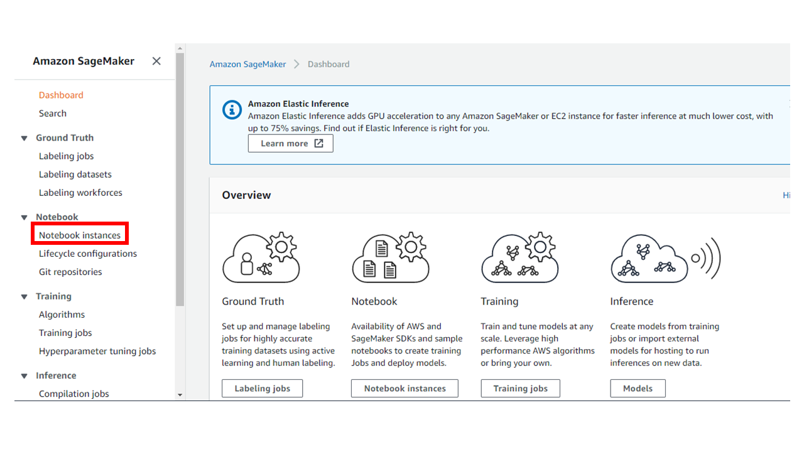

Click **Notebook instances** from the left navigation bar

Select **Create notebook instance**

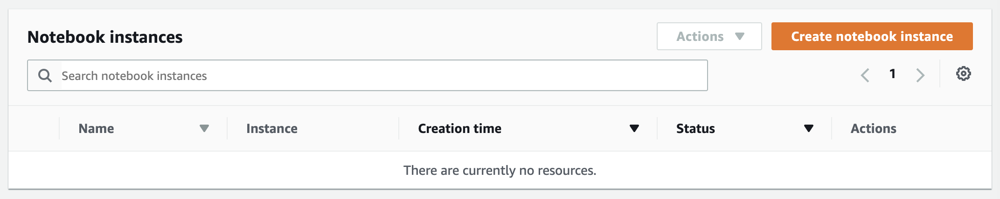

Within the notebook instance creation form, select "c5.4xlarge" for **Notebook instance type**

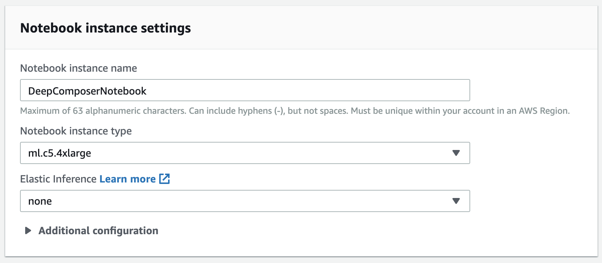

Set the following for **Permissions and encryption**:
* IAM role: Use an existing role or create a new role
* Root access: Enable
* Encryption key: No Custom Encryption

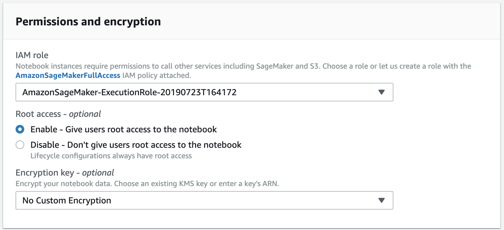

Set the following for **Git repositories**:
* Repository: Clone a public Git repository to this notebook instance only
* Git repository URL: https://github.com/aws-samples/aws-deepcomposer-samples

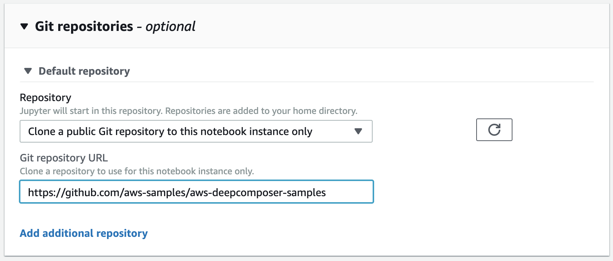

Click **Open Jupyter**

Click **Lab 2** folder, then click **GAN.ipynb**

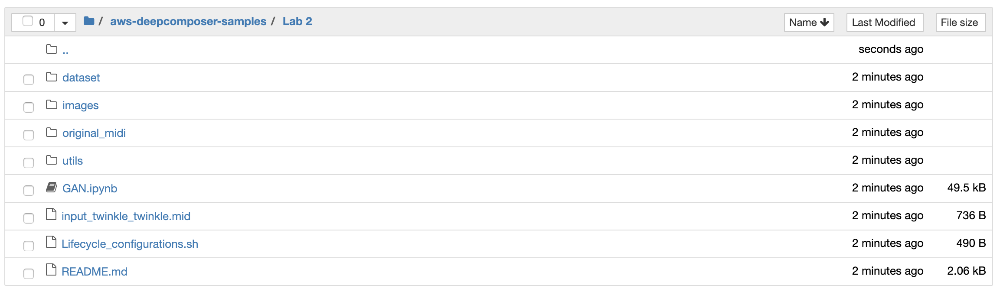

*You will likely be prompted to select kernel. Choose the drop down and select **conda_python3** as the kernel*

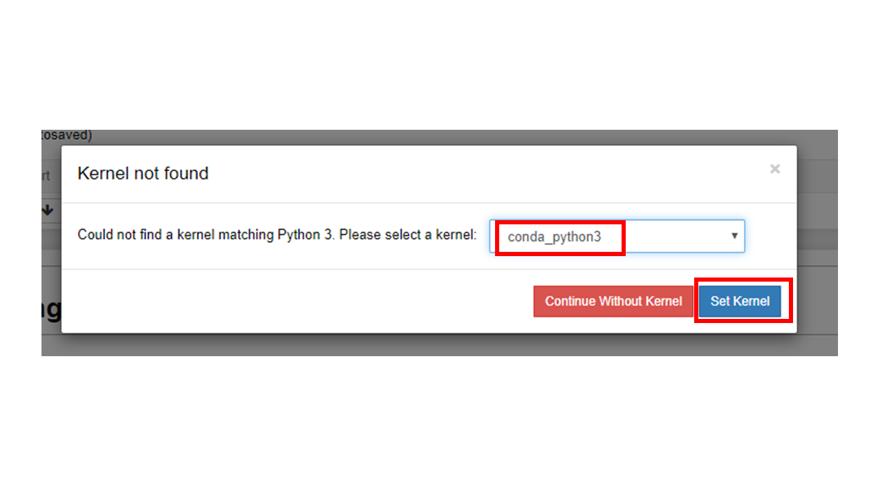

This notebook contains instructions and code to create a custom GAN model from scratch. Follow the notebook content and run all cells to the end.

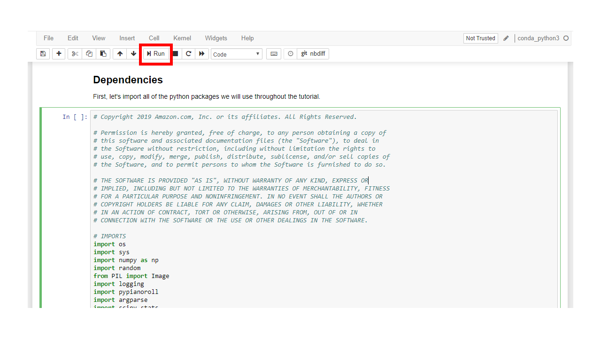

To run the code cells, choose the code cell you want to run and click **Run**

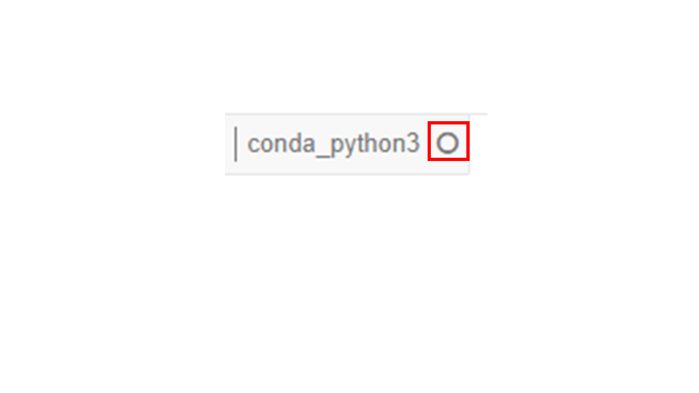

If the kernel has an empty circle, it means it is free and ready to execute the code 

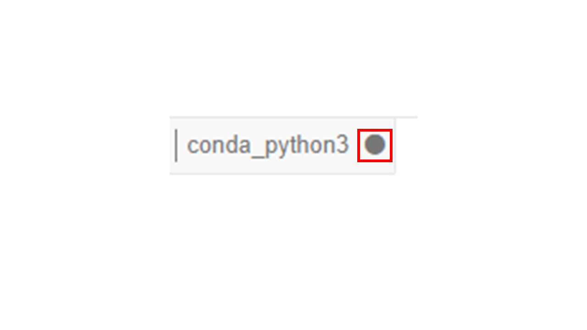

If the kernel has a filled circle, it means it is busy. Wait for it to become free before you execute the next line of code.

## Next Steps

**Congratulations on building a custom GAN model from scratch!** 

Now try using your model to create compositions based on your custom MIDI input.

**Important: Remember to stop your Amazon SageMaker instances after you're done to avoid extra charges**

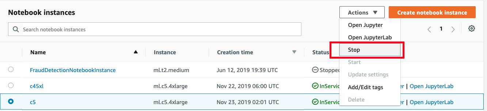